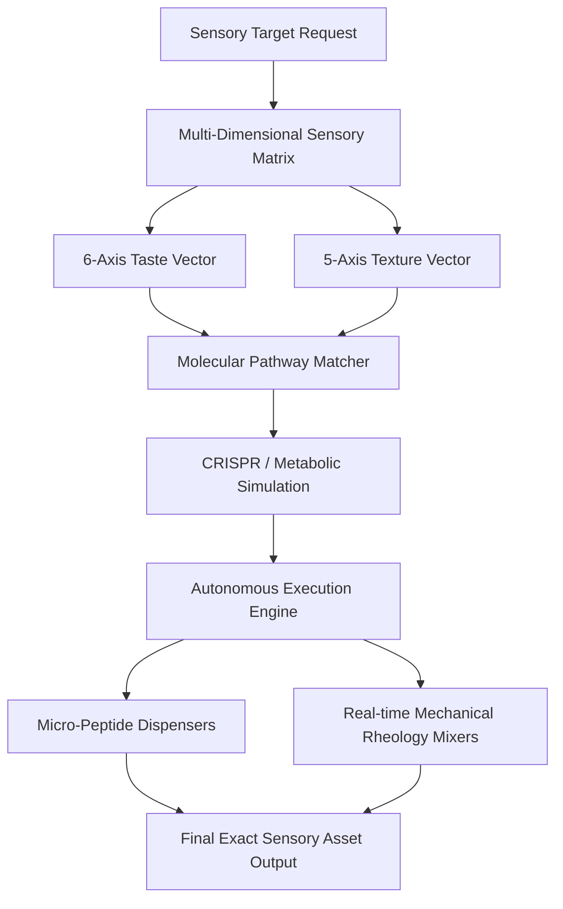

# Gastronomix Matrix Framework (v1.0-Alpha)

## Overview
Gastronomix is the foundational open-source architecture for **Computational Culinary Science**—a discipline fusing multi-dimensional biological sensory vector spaces, molecular pathway simulation, and autonomous physical robotic execution. By treating flavor and texture as calculable coordinate spaces, this framework enables a universe computer simulation to auto-generate structurally exact recipes for hardware automated rigs and humanoid robotics.

---

## 1. System Architecture Pipeline

---

## 2. The Multi-Dimensional Sensory Matrix

### A. The 6-Axis Taste Vector ($\vec{T}$)
The system maps flavor density by balancing six foundational chemical and neurological modulators to achieve exact human palate replication:

1. **Sweet ($T_{sw}$):** Monosaccharide and disaccharide molecular alignment tracking ($C_6H_{12}O_6$).
2. **Salty ($T_{sa}$):** Sodium chloride ($NaCl$) ionic lattice density optimization to suppress bitterness.
3. **Sour ($T_{so}$):** Volatile hydrogen ion ($H^+$) concentration and acid-solvent acceleration mapping.
4. **Bitter ($T_{bi}$):** Controlled alkaloid mapping to establish structural flavor complexity.
5. **Umami ($T_{um}$):** Free glutamate density optimization targeting explicit $T1R1 / T1R3$ tongue receptor nodes.
6. **Kokumi ($T_{ko}$):** Gamma-glutamyl peptide concentrations targeting calcium-sensing receptors ($CaSR$). Manages global cohesion, oral thickness ("mouthfulness"), and extended temporal lingeringness.

### B. The 5-Axis Texture Vector ($\vec{M}$)
To calculate mechanical behavior and material structural outcomes for automated baking systems, the framework defines five physical rheological axes:

1. **Elasticity ($M_{el}$):** The kinetic spring-back memory coefficient of the hydrated gluten matrix.
2. **Viscosity ($M_{vi}$):** The explicit fluid resistance to mechanical shear deformation during fluid layer blending.
3. **Density / Porosity ($M_{de}$):** The internal void-space gas cell distribution volume achieved via metabolic yeast or chemical leavening cycles.
4. **Moisture Retention ($M_{mo}$):** The precise thermodynamic balance ratio of bound vs. free water molecules inside the crumb structure.
5. **Hardness / Fracturability ($M_{ha}$):** The peak structural yield force required to fracture the crystallized outer crust layer.

---

## 3. The Molecular Pathway Matcher

When the sensory matrix requires an elite, non-standard flavor coordinate to satisfy the global **Kokumi ($T_{ko}$)** metric (e.g., the complex, lost ancient Roman seasoning **Silphium**), the system triggers metabolic pathway engineering simulations:

* **Genome Alignment:** Utilizes living botanical targets (e.g., *Ferula drudeana*) as a base living template genome.
* **CRISPR Target Modeling:** Simulates targeted gene upregulations of specific volatile terpenes (*pinene isomers*, *α-gurjunene*) and gene knockouts of unpleasant volatile sulfur compounds.
* **Metabolic Splicing:** Simulates cross-species DNA trait splices to synthetically match the exact historical resin metabolite footprint.

---

## 4. Autonomous Hardware Execution

The execution engine translates the calculated sensory vector arrays into real-time machine hardware instructions:

* **Micro-Peptide Delivery:** High-precision digital valves measure out sub-milligram raw weights of concentrated glutamates, acids, and synthesized Kokumi-active resin compounds.
* **Dynamic Feedback Mixing:** High-torque mixers monitor mechanical dough resistance in real time, auto-adjusting liquid-to-solid mass injection parameters on-the-fly until the dough matrix hits the mathematically calculated Elasticity ($M_{el}$) baseline coordinate.
* **Thermal Ingestion:** Monitored baking chambers finalize the structural phase transition, rendering a physically exact asset optimized for the human neurological response system.

---
## License
This framework is open-sourced under the MIT License. Copyright (c) 2026 RZN AI, LLC.
